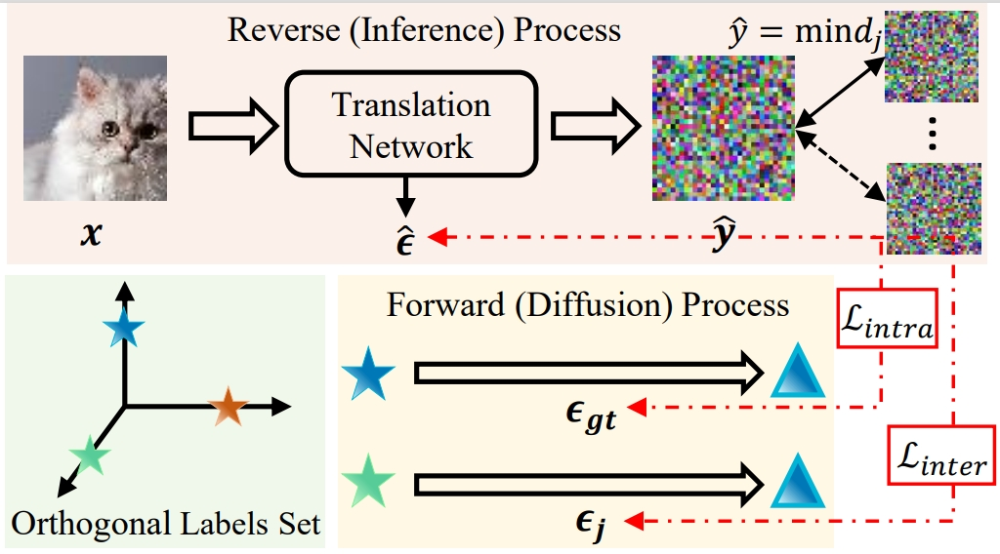

# Efficient Image-to-Label Diffusion Classifier for Adversarial Robustness

**Hefei Mei, Minjing Dong, Chang Xu**

<div align="center">

</div>

## Requirements

We evaluate the robustness of the IDC based on [torchattacks](https://github.com/Harry24k/adversarial-attacks-pytorch/tree/master) (PGD, FGSM, MIFGSM, CW, AutoAttack) and [DiffPure](https://github.com/NVlabs/DiffPure) (only for BPDA+EOT). If you only need the classifier or the former robustness evaluation, you can follow the Requirements in [BBDM](https://github.com/xuekt98/BBDM) and install the torchattacks. Otherwise, you can install the following combined environment.

- CUDA=10.2

- Python 3.9
1. Create environment:

```
conda create -n IDC python=3.9
conda activate IDC
pip install -r requirements
```

2. Put the file [_pytree.py](https://github.com/pytorch/pytorch/blob/v1.8.1/torch/utils/_pytree.py) in anaconda/envs/IDC/lib/python3.9/site-packages/torch/utils

## Train

- cd IDC/

If you wish to train from the beginning

```
# For CIFAR-10
python main.py --config configs/Template-IDC-cifar10.yaml
--train
--sample_at_start
--save_top
--gpu_ids 0,1,2,3
```

```
# For CIFAR-100
python main.py --config configs/Template-IDC-cifar100.yaml
--train
--sample_at_start
--save_top
--gpu_ids 0,1,2,3
```

If you wish to continue training

```
# For CIFAR-10
python main.py --config configs/Template-IDC-cifar10.yaml
--train
--sample_at_start
--save_top
--gpu_ids 0,1,2,3
--resume_model path/to/model_ckpt
--resume_optim path/to/optim_ckpt
```

```
# For CIFAR-100
python main.py --config configs/Template-IDC-cifar100.yaml
--train
--sample_at_start
--save_top
--gpu_ids 0,1,2,3
--resume_model path/to/model_ckpt
--resume_optim path/to/optim_ckpt
```

- We use auto_lr_scheduler=True with batch_size 256 (64*4), if you will train the model with other batch_size and lr, you can set use auto_lr_scheduler=False for similar accuracy. 

## Test

- cd IDC/

```
# For CIFAR-10
bash test_torchattacks_cifar10.sh
```

```
# For CIFAR-100
bash test_torchattacks_cifar100.sh
```

- cd IDC-BPDA/

```
# For CIFAR-10
bash test_bpda_cifar10.sh
```

```
# For CIFAR-100
bash test_bpda_cifar100.sh
```

## Pre-trained Model

| Dataset   | Log                                                                                                                                                       | Checkpoint                                                                                                                                                 |
| --------- |:---------------------------------------------------------------------------------------------------------------------------------------------------------:|:----------------------------------------------------------------------------------------------------------------------------------------------------------:|
| CIFAR-10  | log_cifar10 [[Google](https://drive.google.com/file/d/1zQz1trVYMzve6G5m_gsYQg6pzdXQqgYw/view?usp=sharing), [Quark](https://pan.quark.cn/s/10346c4b5304)]  | ckpt_cifar10 [[Google](https://drive.google.com/file/d/1_tawQqStBh9TQ6n2nKqHte1Ei2w309UD/view?usp=sharing), [Quark](https://pan.quark.cn/s/e930c1e3f717)]  |
| CIFAR-100 | log_cifar100 [[Google](https://drive.google.com/file/d/1DpdMLN7VE-qRRUrzngPHXoVmSiF5g6ZT/view?usp=sharing), [Quark](https://pan.quark.cn/s/bea871686138)] | ckpt_cifar100 [[Google](https://drive.google.com/file/d/1H-84EyE64hW0KBnDwe8pjmiGsOcfjxyZ/view?usp=sharing), [Quark](https://pan.quark.cn/s/dee4a0a499e4)] |

## Acknowledgement

Our code is implemented based on [BBDM](https://github.com/xuekt98/BBDM), [DiffPure](https://github.com/NVlabs/DiffPure) and [torchattacks](https://github.com/Harry24k/adversarial-attacks-pytorch/tree/master), thanks for their excellent works.
